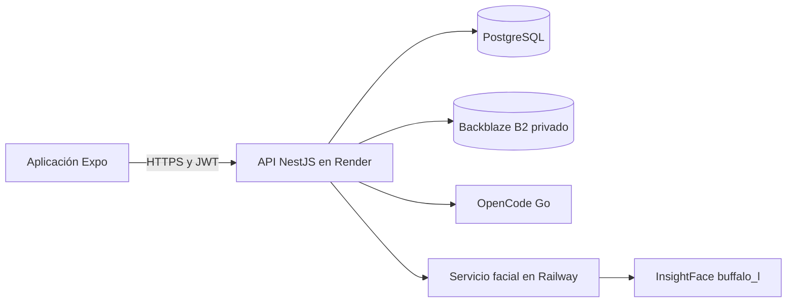
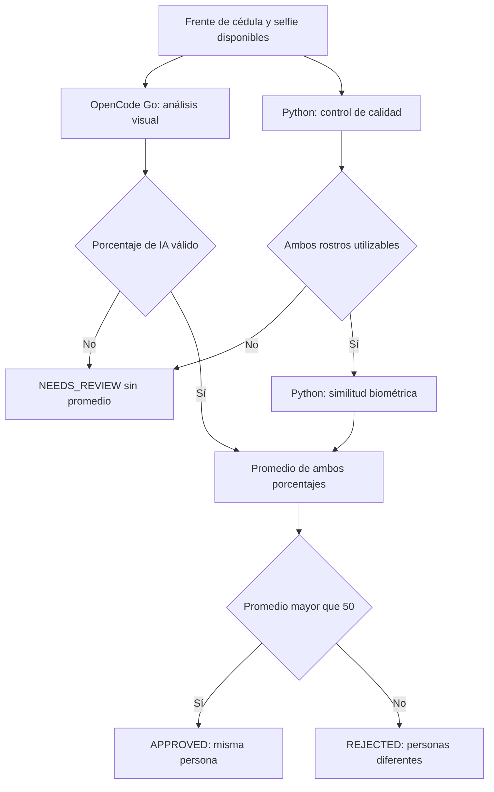
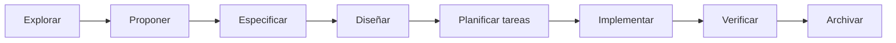

# Kora KYC — plataforma de verificación de identidad

Kora es un MVP de verificación de identidad compuesto por una aplicación
móvil Expo y un backend NestJS. El usuario captura el frente y el reverso de
una cédula colombiana, realiza una ráfaga de selfies candidatas y recibe el resultado de una
verificación que combina:

1. Validación documental con OpenCode Go.
2. Comparación biométrica con InsightFace en un servicio Python.
3. Una segunda opinión visual de OpenCode Go usando el frente de la cédula y
   la selfie candidata seleccionada.
4. Un promedio persistido de los dos porcentajes faciales calculado sobre la
   misma selfie seleccionada.

El backend es la autoridad del sistema. El frontend sólo captura evidencia,
consume la API y presenta el estado; no contiene secretos ni implementa reglas
de aprobación.

> **Estado de seguridad:** este proyecto no implementa prueba de vida ni
> protección anti-spoofing. La comparación facial es una señal de similitud de
> imágenes y no demuestra que una persona esté físicamente presente.

## Índice de documentación

La documentación está separada para que cada lector pueda profundizar sin
perder el contexto general:

- [Backend: API, worker, proveedores, base de datos y seguridad](backend/README.md)
- [Frontend: captura, navegación, API, perfil e historial](frontend/README.md)
- [Servicio facial Python: FastAPI, InsightFace y despliegue](backend/face-service/README.md)
- [Configuración de despliegue](render.yaml)
- [Guía de agentes y límites arquitectónicos](AGENTS.md)

## Inicio rápido

El repositorio **no es un workspace de Node**. Cada aplicación tiene su propio
gestor de paquetes y sus propios comandos.

### Backend

```bash
cd backend
pnpm install
pnpm prisma:generate
pnpm prisma migrate deploy
pnpm start:dev
```

### Frontend

```bash
cd frontend
bun install
bun start
```

### Servicio facial

```bash
cd backend/face-service
python -m venv .venv
source .venv/bin/activate
pip install -r requirements.txt
python -m compileall app
uvicorn app.main:app --host 0.0.0.0 --port 8080
```

Los comandos se ejecutan dentro de la aplicación correspondiente. No se deben
instalar dependencias, crear `node_modules` ni crear lockfiles en la raíz.

## Arquitectura general

```text
┌─────────────────────────────┐
│ Expo / React Native          │
│ Cámara · perfil · historial  │
└──────────────┬──────────────┘
               │ HTTPS + JWT
               ▼
┌─────────────────────────────┐
│ NestJS en Render             │
│ API · auth · worker · reglas │
└───────┬───────────┬─────────┘
        │           │
        │           ├── PostgreSQL mediante Prisma
        │           └── Backblaze B2 privado
        │
        ├── OpenCode Go: documentos
        ├── OpenCode Go: resumen dual FRONT + SELFIE
        └── Railway: FastAPI + InsightFace
```

| Componente | Responsabilidad | Por qué existe |
| --- | --- | --- |
| `frontend/` | Capturar imágenes, mostrar estados y consultar la API | Mantiene la lógica sensible fuera del dispositivo |
| `backend/` | Autenticación, transición KYC, almacenamiento, worker y decisión | Centraliza la autoridad y evita reglas divergentes |
| `backend/face-service/` | Calidad facial, embeddings y similitud biométrica | Aísla dependencias pesadas de Python/InsightFace |
| OpenCode Go | Extracción documental y explicación visual complementaria | Usa el proveedor configurado sin mover claves al frontend |
| PostgreSQL | Estado, metadatos, campos tipados, métricas e historial | Permite auditoría y consultas consistentes |
| Backblaze B2 | Persistencia privada de documentos y selfies | Evita guardar imágenes sensibles en el filesystem efímero |
| Render | Ejecutar el backend NestJS | Servicio HTTP principal |
| Railway | Ejecutar el servicio Python siempre activo | Evita cargar el modelo facial en cada solicitud |

En producción, `FACE_SERVICE_URL` apunta al servicio Python de Railway. El
blueprint conserva configuración compatible para el servicio facial antiguo de
Render, pero no es el servicio usado por el backend cuando la variable apunta a
Railway.

### Diagrama de componentes



El frontend sólo conoce la API NestJS. PostgreSQL, B2, OpenCode y Railway no se
exponen directamente al dispositivo.

## Flujo completo de una verificación

### 1. Captura de evidencia

El frontend guía al usuario por cuatro pasos:

1. **Frente:** evidencia `FRONT` de la cédula.
2. **Reverso:** evidencia `BACK`.
3. **Rostro:** evidencia `SELFIE`.
4. **Validación:** el backend procesa la verificación.

La captura de selfie utiliza una previsualización acotada a 4:3 y un marco
ovalado que evita cortar la parte inferior del rostro. La fotografía final usa
la resolución segura confirmada por `expo-camera`.

### 2. Almacenamiento privado

Cada imagen se valida en el backend por tamaño, dimensiones, tipo y contenido.
El objeto se guarda en B2 y PostgreSQL conserva únicamente el metadato y la
clave interna. El frontend nunca recibe credenciales de B2 ni una URL pública.

### 3. Clasificación documental

OpenCode Go recibe las imágenes documentales etiquetadas como `FRONT`, `BACK` o
`COMBINED`. Devuelve una respuesta estructurada que el backend valida antes de
persistirla.

Debe identificar una cédula colombiana (`COLOMBIAN_CEDULA`). Si el usuario sube
una licencia, pasaporte, foto aleatoria, pantalla, reverso aislado u otro
objeto, el proceso no debe aprobar. El frontend presenta, según el código:

> **Lo que subiste no es una cédula.**

La extracción documental no recibe la selfie. Existe una llamada separada de
comparación visual que sí recibe el frente confirmado y la selfie, porque su
objetivo es comparar rostros y generar una explicación.

### 4. Comparación facial doble

El worker selecciona el frente de la cédula —o un `COMBINED` confirmado cuando
corresponde— y lo compara con la selfie mediante dos señales:

#### Señal biométrica técnica

El backend llama a Railway:

```text
POST /face/quality
POST /face/compare
```

Python/InsightFace detecta rostros, verifica calidad, genera embeddings y
calcula similitud coseno. Esta señal se guarda en `faceSimilarity` como un
valor normalizado de `0..1` y se muestra como porcentaje.

#### Señal visual complementaria de IA

OpenCode Go recibe ambas imágenes y devuelve un JSON estricto con:

```json
{
  "verdict": "same_person",
  "similarity_percent": 90,
  "summary": "La estructura facial presenta coincidencias fuertes; la similitud visual aproximada es 90%."
}
```

El resumen se limita a texto breve en español y no debe repetir nombres,
números de documento ni OCR. Su porcentaje es una estimación visual, no una
probabilidad biométrica calibrada.

#### Promedio final

Cuando existen los dos valores:

```text
biométrica = faceSimilarity × 100
promedio = (biométrica + faceAiSimilarityPercent) / 2
```

La regla final es deliberadamente simple, pero exige un piso biométrico
independiente para evitar que la IA compense una biometría demasiado baja:

- Biometría `>= KYC_FACE_MIN_BIOMETRIC_PERCENT` y `promedio > 50`:
  `APPROVED`, `same_person`.
- `promedio <= 50`: `REJECTED`, `different_person`.
- Biometría debajo del piso: `NEEDS_REVIEW`, sin aprobación automática.
- Falta uno de los dos valores: `NEEDS_REVIEW`; nunca se inventa el porcentaje.

Ejemplo:

```text
Biométrica: 28%
IA:         90%
Promedio:   59%
Resultado:  APPROVED — misma persona
```

El promedio se calcula y persiste en el backend. El frontend no lo recalcula
para tomar decisiones; sólo lo presenta.

### Diagrama de decisión facial



## Estados de negocio

```text
CREATED
  → DOCUMENT_UPLOADED
  → SELFIE_UPLOADED
  → VALIDATING
  → APPROVED
  → REJECTED
  → NEEDS_REVIEW
  → PROCESSING_FAILED
```

Las cuatro últimas salidas son terminales. El estado `NEEDS_REVIEW` significa
que el sistema no pudo tomar una decisión automatizada completa con evidencia
suficiente. No significa aprobación.

Reglas de evidencia documental:

- `FRONT` y `BACK` son la ruta normal.
- Sólo puede existir una imagen por lado.
- Una nueva carga del mismo lado reemplaza la evidencia anterior.
- `COMBINED` agrupa ambos lados y no puede coexistir con `FRONT` o `BACK`.
- Falta de lado, cobertura incompleta o lectura privada fallida termina en
  revisión o fallo cerrado.
- El reverso nunca se usa para comparar rostros.

## Persistencia y pantallas

`KycVerification` conserva el resultado técnico, el resultado complementario y
el resultado combinado:

```text
faceDistance
faceSimilarity
faceAiVerdict
faceAiSimilarityPercent
faceAiSummary
faceAiProvider
faceAiProviderModel
faceCombinedSimilarityPercent
faceCombinedVerdict
```

Estos valores se exponen de forma controlada en:

- Home: estado final de la verificación.
- Perfil: detalle de la verificación actual.
- Resultado: estado y desglose después de procesar.
- Historial: lista y detalle de verificaciones anteriores.

Las imágenes de evidencia se abren desde el detalle en un visor privado de
pantalla completa con cierre, desplazamiento y controles de zoom.

## Despliegue

### Backend en Render

El backend se construye desde `/backend` con `backend/infra/Dockerfile`. Las
migraciones pendientes se ejecutan antes de iniciar la aplicación.

Variables de selección —sin valores sensibles—:

```text
FILE_STORAGE_PROVIDER=b2
B2_BUCKET_NAME=kora-storage
KYC_DOCUMENT_PROVIDER=opencode-go
FACE_VERIFICATION_PROVIDER=face_service
FACE_SERVICE_URL=https://kora-kyc-production.up.railway.app
FACE_SERVICE_TIMEOUT_MS=120000
FACE_API_KEY=<secreto compartido con Railway>
KYC_FACE_MIN_BIOMETRIC_PERCENT=30
```

### Servicio facial en Railway

El servicio se construye desde `/backend/face-service`, descarga el modelo
durante el build y queda listo mediante `/ready`. La configuración actual usa:

```text
INSIGHTFACE_MODEL=buffalo_l
FACE_API_KEY=<secreto privado>
```

El warning de `CUDAExecutionProvider` es esperado cuando la instancia no tiene
GPU. InsightFace continúa usando `CPUExecutionProvider`.

### PostgreSQL y B2

PostgreSQL se conecta mediante `DATABASE_URL` y Prisma. B2 se configura con
`B2_BUCKET_NAME`, `B2_KEY_ID` y `B2_APPLICATION_KEY`. El bucket debe permanecer
privado.

## Desarrollo guiado por especificaciones (SDD)

La implementación se organizó con el flujo SDD —Spec-Driven Development— para
evitar que la lógica se repartiera de manera improvisada entre aplicaciones:

```text
explore → proposal → spec → design → tasks → apply → verify → archive
```

La intención de cada etapa fue:

1. **Explore:** entender el código actual, las restricciones de privacidad y
   los puntos de integración.
2. **Proposal:** establecer el resultado de producto, el alcance y los no
   objetivos.
3. **Spec:** convertir el alcance en requisitos y escenarios comprobables.
4. **Design:** definir límites entre frontend, backend, Python, OpenCode, B2 y
   PostgreSQL.
5. **Tasks:** ordenar migraciones, contratos, implementación, UI y validación.
6. **Apply:** implementar por unidades coherentes.
7. **Verify:** ejecutar pruebas, typecheck, build y comprobaciones de contrato.
8. **Archive:** registrar el estado final y las decisiones relevantes.

### Diagrama del ciclo SDD



La razón de usar SDD fue especialmente importante aquí: el cambio combinaba
PII, dos proveedores de visión, una migración de datos, un worker asíncrono,
servicios desplegados separadamente y cambios de presentación en varias
pantallas.

## Validación local

```bash
# Backend
cd backend
pnpm test
pnpm build

# Frontend
cd ../frontend
bun run typecheck
bun test

# Servicio Python
cd ../backend/face-service
python -m compileall app
pytest -q
```

Si `pytest` no está instalado localmente, debe ejecutarse en el entorno de CI o
instalar las dependencias de desarrollo del servicio facial.

## Seguridad y límites

- Nunca subir `.env`, secretos, URLs de base de datos, tokens, imágenes ni
  respuestas crudas de proveedores.
- Rotar inmediatamente cualquier credencial expuesta en chat, logs o commits.
- No registrar cuerpos HTTP, base64, selfies, documentos, embeddings u OCR.
- Mantener separados `JWT_SECRET` y `KYC_DOCUMENT_HASH_PEPPER`.
- No transmitir la selfie al extractor documental; sólo a la comparación facial
  explícita.
- No agregar fallbacks que aprueben ante error, timeout, modelo ausente o
  respuesta inválida.
- No incorporar AWS ni infraestructura AWS.
