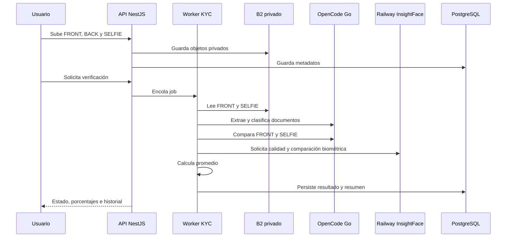

# Backend Kora KYC

Backend NestJS que concentra toda la autoridad de la verificación: autenticación,
transición de estados, validación de archivos, almacenamiento privado,
selección de proveedores, procesamiento asíncrono, persistencia e historial.

## Objetivo arquitectónico

El backend se diseñó como un límite de confianza único. El frontend no decide
si una persona coincide, no conoce las claves de OpenCode/B2/PostgreSQL y no
interpreta directamente los estados internos. Todas las decisiones relevantes
se toman aquí y quedan asociadas a una verificación persistida.

```text
HTTP Controller
      ↓
KycService / Auth
      ↓
Prisma + FileStoragePort
      ↓
KycProcessingWorker
      ├── DocumentExtractionProvider
      ├── FaceAiVerificationProvider
      └── FaceVerificationProvider
```

## Comandos

Todos se ejecutan desde `backend/`:

```bash
pnpm install
pnpm prisma:generate
pnpm prisma migrate deploy
pnpm start:dev
pnpm test
pnpm build
```

Para crear una migración después de modificar el schema durante desarrollo:

```bash
pnpm prisma migrate dev --name descripcion_del_cambio
pnpm prisma:generate
```

En producción se aplica `prisma migrate deploy`; nunca se debe usar un reset
destructivo contra la base compartida.

## Flujo y máquina de estados

```text
CREATED
  → DOCUMENT_UPLOADED
  → SELFIE_UPLOADED
  → VALIDATING
  → APPROVED | REJECTED | NEEDS_REVIEW | PROCESSING_FAILED
```

El worker procesa una verificación mediante un job idempotente. Antes de
procesar verifica que la verificación siga en `VALIDATING`, que existan las
imágenes y que exista el consentimiento requerido para procesamiento externo.

Una transición terminal conserva el estado, el motivo y las métricas que sí se
pudieron obtener. Un fallo nunca se transforma en aprobación por degradación.

### Secuencia de procesamiento



## API principal

Las rutas concretas se encuentran en `src/kyc/kyc.controller.ts`. El contrato
principal es:

| Ruta | Propósito |
| --- | --- |
| `POST /kyc/document` | Subir o reemplazar evidencia documental etiquetada |
| `POST /kyc/selfie` | Subir o reemplazar una selfie individual, para compatibilidad |
| `POST /kyc/selfie/candidates` | Subir entre dos y tres selfies candidatas |
| `POST /kyc/verify` | Encolar la verificación |
| `GET /kyc/current` | Obtener la verificación activa del usuario |
| `GET /kyc/history` | Obtener verificaciones finalizadas, paginadas |
| `GET /kyc/history/:verificationId` | Obtener el detalle de una verificación propia |
| `GET /kyc/media/:mediaId` | Descargar una imagen mediante autorización |
| `GET /health` | Health check del proceso |

Las rutas autenticadas aplican autorización por usuario. El historial no permite
consultar verificaciones de otra cuenta y aplica la retención configurada.

## Proveedores documentales

### OpenCode Go

Con `KYC_DOCUMENT_PROVIDER=opencode-go`, el provider envía imágenes
documentales etiquetadas y exige una respuesta estructurada. El backend valida:

- El tipo `COLOMBIAN_CEDULA`.
- La presencia y forma de los campos mínimos.
- La cobertura `FRONT`/`BACK`.
- El código de razón canónico.
- La ausencia de respuesta cruda no estructurada.

El prompt de extracción indica que sólo se debe identificar y extraer el mínimo
necesario. No se guarda la respuesta OCR cruda. La selfie no se envía en esta
etapa.

### Proveedor local de desarrollo

El provider local/Tesseract existe para desarrollo y pruebas explícitas. No es
un fallback automático de OpenCode Go. Si el proveedor configurado falla, el
worker termina en el estado de fallo o revisión correspondiente.

## Comparación facial

Hay dos providers con responsabilidades distintas.

### `FaceVerificationProvider`: biometría Python

`FaceServiceVerificationProvider` llama al servicio FastAPI de Railway:

1. `POST /face/quality` recibe el frente y la selfie y verifica que ambos
   contengan un rostro usable.
2. `POST /face/compare` genera la comparación sólo si la calidad fue suficiente.
3. El resultado técnico se valida, se normaliza y se guarda en
   `faceSimilarity`/`faceDistance`.

Un rostro ausente, pequeño, borroso o una respuesta inválida no se convierte en
un match. Los retries se limitan a fallos transitorios de red/servidor; no se
reintenta indefinidamente un resultado determinista de baja calidad.

### `FaceAiVerificationProvider`: OpenCode Go complementario

`OpenCodeGoFaceAiVerificationProvider` reutiliza las credenciales y el modelo
OpenCode Go existentes, pero usa una solicitud diferente. Envía el frente
documental y exactamente la selfie candidata que obtuvo la mayor similitud
biométrica:

```text
document_front + selected_selfie
```

El provider exige:

```text
verdict: same_person | different_person | needs_review
similarity_percent: 0..100 o null
summary: texto corto en español
```

El resumen no debe incluir nombres, números ni OCR. Un resultado malformado,
fuera de rango o ausente queda sin persistir como señal válida.

### Regla combinada

Cuando existen los dos números:

```text
biometric_percent = faceSimilarity * 100
combined_percent = (biometric_percent + faceAiSimilarityPercent) / 2
```

La condición final es estricta:

```text
biometric_percent >= KYC_FACE_MIN_BIOMETRIC_PERCENT
combined_percent > 50  → APPROVED / same_person
combined_percent <= 50 → REJECTED / different_person

El piso biométrico es una condición necesaria adicional. Si no se alcanza, el
worker devuelve `NEEDS_REVIEW` aunque el promedio aritmético supere 50.
```

### Relación entre los valores

```mermaid
flowchart TD
    A[faceSimilarity: 0..1] --> B[Multiplicar por 100]
    B --> C[Porcentaje biométrico]
    D[faceAiSimilarityPercent: 0..100] --> E[Porcentaje de IA]
    C --> F[(Biométrica + IA) / 2]
    E --> F
    F --> G[faceCombinedSimilarityPercent]
    G --> H{Mayor que 50}
    H -->|Sí| I[APPROVED]
    H -->|No| J[REJECTED]
```

Si la IA está configurada pero no entrega un porcentaje válido, la salida es
`NEEDS_REVIEW`. Así se evita aprobar usando una sola señal cuando el requisito
de negocio exige el promedio de ambas.

## Worker y persistencia

El worker ejecuta, en orden:

1. Leer metadatos de la verificación.
2. Leer documentos y todas las selfies candidatas desde el storage port.
3. Ejecutar extracción documental.
4. Validar tipo, perfil y cobertura.
5. Seleccionar el frente que se usará para rostro.
6. Ejecutar calidad y comparación Python para cada selfie candidata.
7. Seleccionar la mayor similitud y persistir esa candidata.
8. Ejecutar el análisis visual OpenCode con frente + la selfie seleccionada.
9. Calcular promedio y veredicto combinado.
10. Persistir el resultado terminal.

Python decide cuál candidata es la mejor señal biométrica. El mismo buffer de
esa candidata se reutiliza en OpenCode, de modo que ambas señales evalúan la
misma imagen. Si ninguna candidata puede compararse, el worker falla de forma
cerrada; OpenCode no sustituye un score biométrico faltante.

## Campos de base de datos

`KycVerification` conserva campos documentales mínimos y estas métricas:

| Campo | Unidad | Significado |
| --- | --- | --- |
| `faceSimilarity` | `0..1` | Similitud técnica Python |
| `faceDistance` | distancia | Distancia derivada del provider facial |
| `faceAiVerdict` | enum textual | Veredicto visual de OpenCode |
| `faceAiSimilarityPercent` | `0..100` | Estimación visual de OpenCode |
| `faceAiSummary` | texto acotado | Explicación en español |
| `faceAiProvider` | texto | Auditoría del provider |
| `faceAiProviderModel` | texto | Auditoría del modelo |
| `faceCombinedSimilarityPercent` | `0..100` | Promedio final |
| `faceCombinedVerdict` | enum textual | Resultado del promedio |

Las migraciones actuales relevantes son:

- `20260906210000_add_ai_face_verification`
- `20260906213000_add_combined_face_score`

El backend devuelve estos campos en `current`, `history` y `history/:id` para
que perfil e historial representen el mismo resultado persistido.

El umbral técnico de Python (`KYC_FACE_MIN_SIMILARITY`) y el piso independiente
de seguridad (`KYC_FACE_MIN_BIOMETRIC_PERCENT`) son controles diferentes. El
segundo evita que un porcentaje alto de OpenCode compense una señal biométrica
demasiado baja. Su valor inicial es `30`; debe recalibrarse con un conjunto de
casos etiquetados antes de cambiarlo en producción.

## Almacenamiento B2

El puerto de archivos permite cambiar de provider sin modificar el worker.
`FILE_STORAGE_PROVIDER=b2` selecciona el adapter B2.

Variables necesarias:

```text
B2_BUCKET_NAME
B2_KEY_ID
B2_APPLICATION_KEY
```

El bucket es privado. El backend autoriza, sube, descarga y elimina objetos; el
cliente sólo consume una ruta autenticada. Las claves de objetos se validan
antes de leer y las imágenes nunca se escriben en logs.

## Seguridad y privacidad

- `DATABASE_URL`, B2, OpenCode Go, Hugging Face, JWT y hash pepper son secretos
  backend-only.
- Los documentos y selfies son PII confidencial.
- La respuesta OCR cruda nunca se guarda.
- Los logs HTTP registran método, ruta, estado, duración e IP, no cuerpos.
- No hay fallback automático que apruebe por error.
- La biometría facial no se presenta como prueba de vida.
- Si una clave se expone, se revoca y rota; no se reutiliza.

## Validación

```bash
pnpm test
pnpm build
```

Los tests cubren estados, cobertura documental, providers, storage, historial,
autorización y respuestas inválidas. Para el servicio Python, consultar
[`backend/face-service/README.md`](face-service/README.md).
