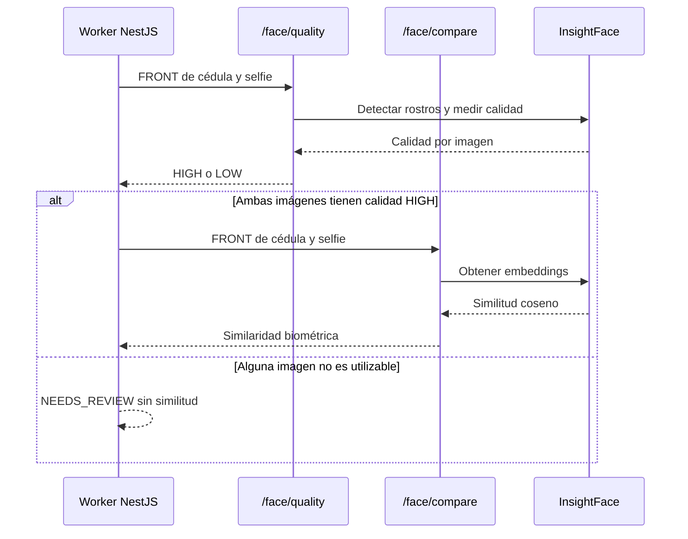

# Servicio facial Python de Kora

Servicio FastAPI aislado que ejecuta InsightFace para evaluar la calidad de las
imágenes y calcular similitud biométrica entre el frente de la cédula y la
selfie. El backend NestJS lo usa únicamente cuando
`FACE_VERIFICATION_PROVIDER=face_service`.

## Por qué existe como servicio separado

InsightFace, ONNX Runtime y sus modelos son dependencias pesadas y específicas
de Python. Separarlas del proceso NestJS permite:

- Construir una imagen de runtime independiente.
- Precargar el modelo una sola vez al iniciar el contenedor.
- Exponer readiness real (`/ready`).
- Escalar o reiniciar el proceso facial sin mezclarlo con la API.
- Mantener las imágenes en memoria y fuera de logs.

## Endpoints

### `GET /health`

Health check de proceso. Devuelve `200` si la aplicación está viva; no garantiza
que el modelo facial esté listo.

### `GET /ready`

Readiness del modelo. Devuelve `200` después de precargar InsightFace y `503`
si el analizador todavía no está disponible.

### `POST /face/quality`

Recibe una estructura con dos imágenes base64:

```json
{
  "document_face": "<base64>",
  "selfie": "<base64>"
}
```

Devuelve calidad separada para documento y selfie:

```json
{
  "document": {
    "quality": "HIGH",
    "reason": "ok",
    "face_width_px": 184,
    "laplacian_variance": 342.1,
    "action": "OK"
  },
  "selfie": {
    "quality": "HIGH",
    "reason": "ok",
    "face_width_px": 512,
    "laplacian_variance": 890.3,
    "action": "OK"
  }
}
```

Los valores numéricos son métricas técnicas, no porcentajes de identidad.

### `POST /face/compare`

Usa la misma forma de request. Primero vuelve a evaluar la calidad y luego,
si ambas imágenes son utilizables, obtiene embeddings y calcula la similitud.
La respuesta contiene el match, similitud, confianza informativa, calidades,
acción y razones por lado. Una respuesta HTTP `200` sólo significa que el
servicio respondió correctamente; no significa que la identidad fue aprobada.

### Secuencia de las rutas



## Autenticación

`/face/quality` y `/face/compare` requieren:

```text
X-API-Key: <FACE_API_KEY>
```

El servicio lee la variable `FACE_API_KEY`. El backend NestJS debe usar el mismo
secreto, pero ningún valor debe estar en el repositorio, logs o documentación.
Si la clave falta o no coincide, la ruta devuelve un error de autenticación y
el backend no debe aprobar.

## Detección y normalización

### Orientaciones documentales

Las imágenes documentales se evalúan en las orientaciones:

```text
0°, 90°, 180°, 270°
```

Esto permite tolerar una captura rotada sin alterar el archivo persistido.
La selfie se evalúa en su orientación normal.

### Detección de rostros pequeños

El retrato de una cédula suele ocupar una parte pequeña de la imagen. Para
reducir falsos `no_face`, el servicio intenta para documentos:

```text
1.0x
1.5x
2.0x
```

El escalado usa interpolación cúbica y se limita a una dimensión máxima de
4096 píxeles para controlar memoria y latencia. Las selfies no se escalan
automáticamente.

### Calidad

La calidad considera, entre otros datos:

- Existencia de un rostro detectable.
- Anchura del rostro en píxeles.
- Nitidez mediante varianza Laplaciana.
- Selección de la mejor detección disponible.

Si falta un rostro, el rostro es demasiado pequeño o la imagen está borrosa,
la respuesta es `LOW`/`NEEDS_REVIEW`. No se genera una similitud ficticia.

## Modelo actual

Railway utiliza:

```text
INSIGHTFACE_MODEL=buffalo_l
```

El modelo se precarga durante el startup. Los logs esperados son:

```text
Applied providers: ['CPUExecutionProvider']
Application startup complete.
GET /ready 200 OK
```

Si aparece un warning indicando que `CUDAExecutionProvider` no está disponible,
el servicio continúa usando CPU. No es un error cuando la instancia no tiene
GPU.

## Comparación biométrica

Cuando los dos rostros pasan calidad:

1. InsightFace obtiene la representación facial de cada imagen.
2. Se calcula similitud coseno.
3. El resultado se valida contra el contrato `-1..1`.
4. NestJS guarda el valor normalizado en `faceSimilarity`.
5. NestJS lo convierte a porcentaje para calcular el promedio con OpenCode.

El umbral técnico configurado por el servicio no debe confundirse con la regla
final de negocio. La decisión final del MVP se calcula en NestJS mediante:

```text
promedio = (porcentaje Python + porcentaje OpenCode) / 2
promedio > 50 → APPROVED
promedio <= 50 → REJECTED
```

Si Python no entrega una similitud o OpenCode no entrega un porcentaje válido,
el promedio no existe y la verificación queda en `NEEDS_REVIEW`.

## Fallos y comportamiento seguro

El servicio falla cerrado:

- Payload inválido: `422` genérico, sin repetir el contenido.
- Clave ausente o incorrecta: `401`/`503`.
- Modelo no preparado: readiness `503`.
- Error al decodificar o analizar imagen: razón `error` y acción de revisión.
- Rostro no detectable: razón `no_face` y acción de revisión.
- Calidad baja: no se continúa a una aprobación.

No hay liveness detection ni anti-spoofing. Una fotografía de buena calidad
puede producir una similitud alta sin demostrar presencia física.

## Despliegue en Railway

El servicio se despliega desde `backend/face-service` con `build.sh`. El build
instala las dependencias, prepara el modelo y arranca Uvicorn en el puerto
asignado por Railway.

Configuración operacional:

```text
INSIGHTFACE_MODEL=buffalo_l
FACE_API_KEY=<secreto>
```

El backend Render debe apuntar a la URL de Railway mediante
`FACE_SERVICE_URL`. Para validar un deployment se deben observar, en este
orden:

```text
startup completo
GET /ready 200
POST /face/quality 200
POST /face/compare 200
```

## Desarrollo local

```bash
cd backend/face-service
python -m venv .venv
source .venv/bin/activate
pip install -r requirements.txt
python -m compileall app
uvicorn app.main:app --host 0.0.0.0 --port 8080
```

Las pruebas Python se ejecutan con:

```bash
pytest -q
```

## Calibración reproducible

El porcentaje de Python y el porcentaje visual de OpenCode no deben calibrarse
con intuición ni con un único caso. El repositorio incluye una herramienta que
trabaja sólo con scores anonimizados ya calculados; no recibe imágenes ni PII.

El CSV debe tener este formato:

```csv
label,biometric_percent,ai_percent
same_person,82,88
same_person,76,81
different_person,24,91
different_person,18,12
```

Ejecutar:

```bash
python scripts/calibrate_thresholds.py calibration_scores.csv
```

La herramienta busca el piso biométrico y el umbral combinado que maximizan la
balanced accuracy del conjunto recibido. El resultado es una recomendación;
no modifica variables de producción automáticamente. Debe validarse con casos
representativos de la población, iluminación, dispositivos, documentos y
condiciones de captura reales.

El valor inicial de seguridad del backend es:

```text
KYC_FACE_MIN_BIOMETRIC_PERCENT=30
```

Un promedio superior a 50 no puede aprobar si el score biométrico no supera ese
piso independiente.

Si `pytest` no existe en el entorno, se debe instalar la dependencia de
desarrollo o delegar la ejecución al pipeline de CI. `compileall` sólo valida
sintaxis; no reemplaza las pruebas de comportamiento.

## Privacidad

- Nunca registrar base64, imágenes, embeddings o cuerpos de request.
- No aceptar URLs de imágenes como sustituto del payload controlado.
- No almacenar el resultado crudo de un proveedor externo en este servicio.
- Mantener `FACE_API_KEY` sólo como secreto de runtime.
- Transportar el tráfico desde NestJS mediante HTTPS en producción.
