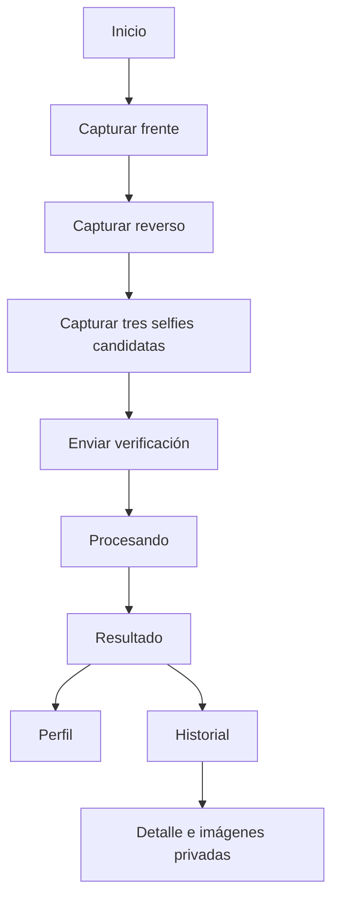
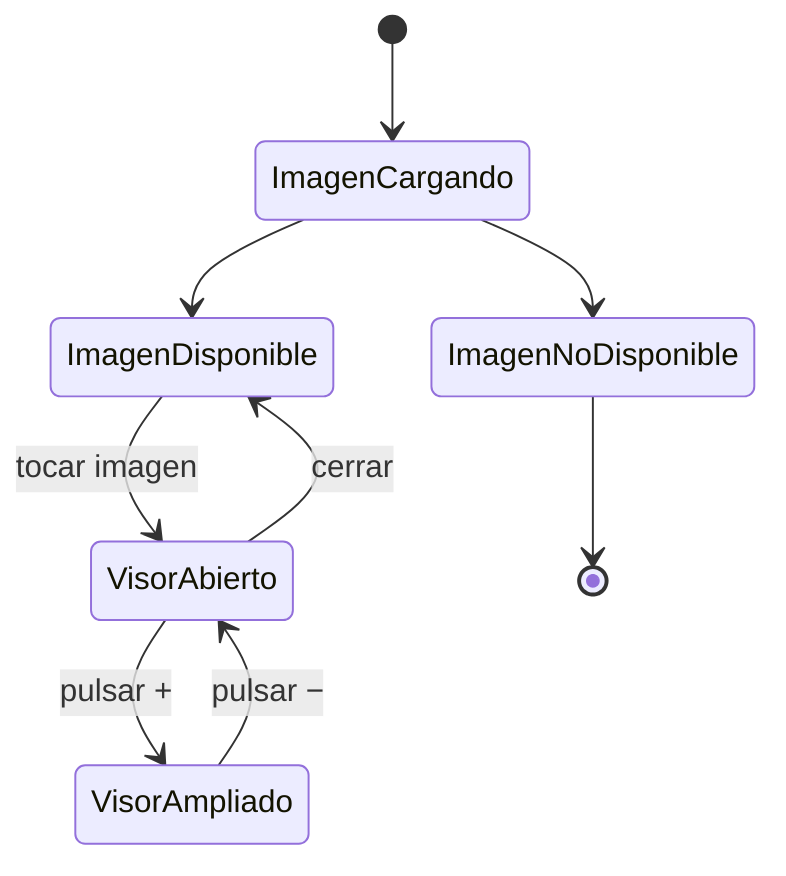

# Frontend Kora KYC

Aplicación móvil Expo/React Native para capturar la evidencia necesaria y
presentar el resultado de la verificación. La app no toma decisiones de
identidad: consume el estado calculado por el backend.

## Responsabilidades

El frontend sí hace:

- Solicitar permiso explícito de cámara.
- Capturar `FRONT`, `BACK` y `SELFIE`.
- Mostrar progreso y errores comprensibles.
- Subir imágenes al backend autenticado.
- Consultar verificación actual e historial.
- Mostrar porcentajes, promedio y resumen persistidos.
- Abrir evidencia privada en un visor ampliado.

El frontend no hace:

- Calcular el promedio para aprobar.
- Decidir si dos rostros son de la misma persona.
- Hablar directamente con B2, PostgreSQL, OpenCode o Railway.
- Guardar claves de providers o respuestas OCR.

## Comandos

Ejecutar desde `frontend/`:

```bash
bun install
bun start
bun run typecheck
bun test
```

## Estructura funcional

```text
src/
├── screens/
│   ├── home-screen.tsx
│   ├── profile-screen.tsx
│   ├── selfie-screen.tsx
│   ├── kyc-history-screen.tsx
│   ├── kyc-history-detail-screen.tsx
│   └── kyc-processing-result-screen.tsx
├── components/
│   ├── camera-capture.tsx
│   ├── kyc-media-image.tsx
│   ├── ai-verification-summary.tsx
│   └── digital-cedula-card.tsx
├── services/
│   ├── api-client.ts
│   ├── kyc-status.ts
│   └── kyc-flow.ts
└── types/api.ts
```

## Flujo de captura

La navegación guía al usuario por:

1. Frente de la cédula.
2. Reverso de la cédula.
3. Ráfaga de tres selfies candidatas.
4. Procesamiento.

`CameraCapture` centraliza permisos, montaje, resolución segura, captura,
reintento controlado y upload. El documento se captura una vez; la pantalla de
selfie captura tres tomas secuenciales y las envía juntas para que el backend
seleccione la de mayor similitud biométrica. El parámetro `frameShape`
diferencia el marco de documento del marco facial.

### Corrección del encuadre de selfie

La previsualización nativa puede recortar contenido cuando el contenedor tiene
una proporción distinta al sensor. Para evitar que la boca o el mentón queden
fuera de la imagen:

- El contenedor se limita a una proporción 4:3.
- No se deja que el preview crezca indefinidamente con `flex: 1`.
- El marco ovalado es más pequeño y se coloca más arriba.
- La imagen capturada usa la resolución segura confirmada por la cámara.

El marco es una guía visual, no una validación biométrica. La validación real
ocurre en el backend y en el servicio Python.

### Flujo de navegación



## API y autenticación

`api-client.ts` centraliza requests, headers JWT, refresh/error handling y
metadatos seguros. El frontend llama al backend para:

```text
POST /kyc/document
POST /kyc/selfie
POST /kyc/selfie/candidates
POST /kyc/verify
GET  /kyc/current
GET  /kyc/history
GET  /kyc/history/:id
GET  /kyc/media/:id
```

Las imágenes no se descargan desde B2 directamente. `getAuthenticatedMediaSource`
obtiene una fuente temporal/autorizada y la componente de imagen la refresca
una sola vez si el token embebido quedó obsoleto.

## Presentación del resultado

El backend devuelve cuatro grupos de datos faciales:

```text
faceSimilarity                 → biométrica Python, 0..1
faceAiSimilarityPercent        → estimación OpenCode, 0..100
faceCombinedSimilarityPercent  → promedio final, 0..100
faceCombinedVerdict            → same_person/different_person/needs_review
faceAiSummary                  → explicación breve en español
```

La tarjeta `AiVerificationSummary` presenta explícitamente:

- **Biométrica técnica:** `faceSimilarity × 100`.
- **Comparación de IA:** `faceAiSimilarityPercent`.
- **Promedio final:** `faceCombinedSimilarityPercent`.
- **Resultado:** veredicto combinado.
- **Resumen:** texto generado por OpenCode.

La app muestra el estado recibido del backend. Si el promedio es mayor que 50,
el backend devuelve `APPROVED` y Home presenta “Identidad verificada”. Si no,
la pantalla refleja `REJECTED` o `NEEDS_REVIEW` según corresponda.

## Perfil e historial

El mismo contrato se presenta en todas las vistas para evitar contradicciones:

- `home-screen`: resumen del estado actual.
- `profile-screen`: datos de cédula y análisis facial actual.
- `kyc-processing-result-screen`: resultado recién finalizado.
- `kyc-history-screen`: lista de verificaciones y porcentaje resumido.
- `kyc-history-detail-screen`: detalle completo, ambos porcentajes, promedio,
  veredicto, resumen y evidencia.

Los datos mostrados provienen de la base de datos a través de la API. No se
reconstruyen desde la última captura local.

## Visor de evidencia privada

`KycMediaImage` se usa en perfil, resultado e historial. Cuando la imagen está
disponible:

1. El usuario la toca.
2. Se abre un `Modal` de pantalla completa.
3. Puede cerrar con `×` o con el back nativo.
4. Puede ampliar/reducir con `+` y `−`.
5. Puede desplazarse por la imagen ampliada.

El visor mantiene la autorización de media, no crea una URL pública y no copia
la imagen a almacenamiento local permanente.

### Flujo del visor de evidencia



## Documento no compatible

Los códigos documentales se traducen a mensajes de usuario en
`services/kyc-status.ts`. Para una imagen que no parece una cédula se muestra:

```text
Lo que subiste no es una cédula
```

La etiqueta se deriva del `reasonCode` entregado por el backend; nunca se decide
analizando la imagen en el frontend.

## Diseño y accesibilidad

La interfaz usa componentes compartidos para botones, estados, tarjetas,
captura y media. Los controles de cámara, modal, cierre y zoom incluyen roles,
labels y estados accesibles. La UI mantiene textos en español para el usuario,
pero los identificadores y contratos de código permanecen en inglés.

## Limitaciones

- Expo/cámara depende de permisos y capacidades del dispositivo.
- El frontend no implementa liveness ni anti-spoofing.
- `bun test` debe ejecutarse en un entorno compatible con React Native; el
  typecheck es obligatorio antes de publicar.
- Las imágenes sólo están disponibles mientras la API autenticada las autorice.
